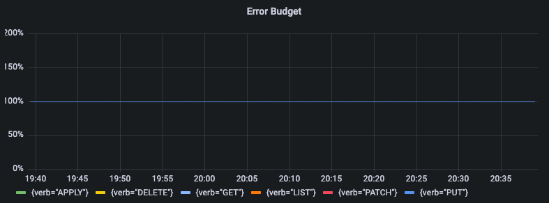

## Availability SLI
### The percentage of successful requests over the last 5m
```commandline
sum (rate(apiserver_request_total{job="apiserver",code!~"5.."}[5m]))
/
sum (rate(apiserver_request_total{job="apiserver"}[5m]))
```


## Latency SLI
### 90% of requests finish in these times
```commandline
histogram_quantile(0.90,
    sum(rate(apiserver_request_duration_seconds_bucket{job="apiserver"}[5m])) by (le, verb)
)
```


## Throughput
### Successful requests per second
```commandline
sum(rate(apiserver_request_total{job="apiserver",code=~"2.."}[5m]))
```


## Error Budget - Remaining Error Budget
### The error budget is 20%
```commandline
1 - % error used
1 - (% error occured / error budget)
1 - ((1-(successful_requests/total_requests)/(1-0.80))
1 - ((1 - (sum(increase(apiserver_request_total{job="apiserver", code="200"}[7d])) by (verb)) / sum(increase(apiserver_request_total{job="apiserver"}[7d])) by (verb)) / (1 - .80))
```

